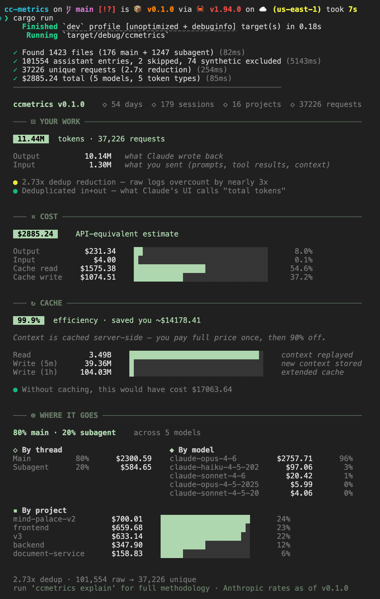

<p align="center">
  <h1 align="center">ccmetrics</h1>
  <p align="center">
    Honest token usage metrics for Claude Code.
    <br />
    <a href="https://crates.io/crates/ccmetrics"><strong>crates.io</strong></a> &middot;
    <a href="https://ishpreet95.me/blog/understanding-claude-code-token-metrics"><strong>Research blog</strong></a> &middot;
    <a href="docs/ARCHITECTURE.md"><strong>Architecture</strong></a>
  </p>
</p>

<p align="center">
  <a href="https://github.com/ishpreet95/ccmetrics/actions/workflows/ci.yml"></a>
  <a href="https://crates.io/crates/ccmetrics"></a>
  <a href="https://github.com/ishpreet95/ccmetrics/blob/main/LICENSE"></a>
</p>

<p align="center">
  
</p>

---

## Why

Every Claude Code usage tool gets the math wrong. We [researched why](https://ishpreet95.me/blog/understanding-claude-code-token-metrics) and built the correct implementation.

| Tool | Output Tokens | Total Cost | Problem |
|------|:---:|:---:|---|
| **ccmetrics** | **8,625,351** | **$2,376** | Correct (final chunk, 5-type split) |
| ccusage | 2,975,552 | $2,032 | First-seen-wins keeps placeholder tokens |
| claudelytics | 12,750,257 | $17,703 | No dedup, counts every streaming chunk |

## Install

```bash
cargo install ccmetrics
```

<details>
<summary>Build from source</summary>

```bash
git clone https://github.com/ishpreet95/ccmetrics.git
cd ccmetrics
cargo install --path .
```
</details>

## Quick start

```bash
ccmetrics                        # Boreal Command dashboard
ccmetrics daily                  # Daily breakdown
ccmetrics session                # Recent sessions
ccmetrics session <id>           # Drill into a session (prefix match)
ccmetrics explain                # Methodology walkthrough on your data
```

### Filters

```bash
ccmetrics --since 7d             # Last 7 days (also: 2w, 30d, today, 2026-03-01)
ccmetrics --until 2026-03-15     # Up to a date
ccmetrics --model opus           # Filter by model (substring, case-insensitive)
ccmetrics --project myapp        # Filter by project name
ccmetrics daily --since 7d       # Filters work with all subcommands
```

### Output

```bash
ccmetrics --json                 # Machine-readable JSON (stable contract)
ccmetrics --verbose              # Detailed stats (file counts, warnings, dedup)
ccmetrics --quiet                # Suppress pipeline progress output
```

## Dashboard

The default view is a 4-section terminal dashboard with the **Boreal Command** design language:

| Section | What it shows |
|---------|---------------|
| **⊡ YOUR WORK** | Deduplicated token totals, input/output breakdown, dedup ratio |
| **¤ COST** | API-equivalent cost estimate, proportional bars per cost type |
| **↻ CACHE** | Cache efficiency %, savings estimate, read/write volume |
| **⊕ WHERE IT GOES** | Main vs subagent split, by-model and by-project breakdowns |

Chip-style hero numbers &middot; full-width section rules &middot; semantic icons &middot; right-aligned columns &middot; proportional bars &middot; contextual insights with severity dots

## What makes it different

| Feature | Detail |
|---------|--------|
| **Correct dedup** | Groups by `requestId`, keeps final chunk (`stop_reason != null`) |
| **5-type token split** | Input, output, cache read, cache write 5m, cache write 1h |
| **Per-model breakdown** | Token and cost split by model for independent verification |
| **Per-project breakdown** | Usage grouped by project (shown when 2+ projects) |
| **Main vs subagent** | Separates main thread from subagent usage and cost |
| **Daily + session views** | Track usage over time, drill into individual sessions |
| **Streaming pipeline** | Real-time progress: scan, parse, dedup, filter, calculate |
| **Pricing modifiers** | Fast mode (6x), data residency (1.1x), long context (2x/1.5x) |
| **Explain mode** | `ccmetrics explain` walks through dedup, pricing, cache tiers on your data |
| **Zero dependencies** | Single Rust binary. No network, no database, no runtime |

## Docs

| | |
|---|---|
| [Research blog](https://ishpreet95.me/blog/understanding-claude-code-token-metrics) | Full analysis of why tools disagree |
| [PRD](docs/PRD.md) | Product requirements (v1.3) |
| [Architecture](docs/ARCHITECTURE.md) | Module layout, data flow |
| [Pricing](docs/PRICING.md) | Embedded pricing table reference |

## License

MIT
